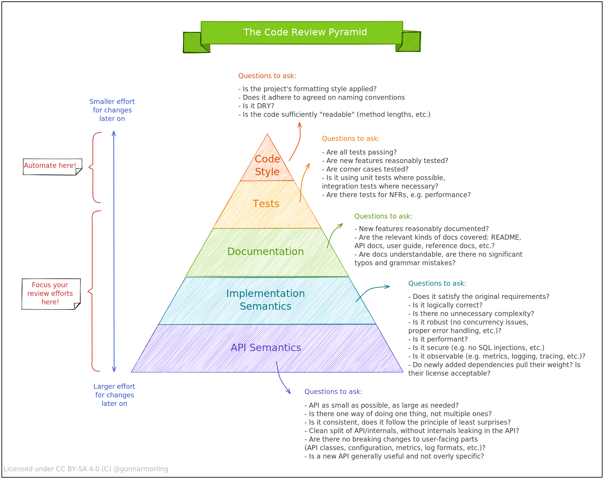

# The Code Review Pyramid

Posted at Mar 10, 2022

When it comes to code reviews, it’s a common phenomenon that there is much focus and long-winded discussions around mundane aspects like code formatting and style, whereas important aspects (does the code change do what it is supposed to do, is it performant, is it backwards-compatible for existing clients, and many others) tend to get less attention.

To raise awareness for the issue and providing some guidance on aspects to focus on, I shared a [small visual](https://twitter.com/gunnarmorling/status/1501645187407388679) on Twitter the other day, which I called the "Code Review Pyramid". Its intention is to help putting focus on those parts which matter the most during a code review (in my opinion, anyways), and also which parts could and should be automated.

As some folks asked for a permanent, referenceable location of that resource and others wanted to have a high-res printing version, I’m putting it here again:



Two goals of Code Review.

- Improve code quality. Find bugs, predict possible bugs, check code clarity, and check consistency of coding style
- Improve programmer level. Code Review to learn new language features, project design, code specification.

Bad taste code example 1.

```java
public static int dayOfYear(int month, int dayOfMonth, int year) {
    if (month == 2) {
        dayOfMonth += 31;
    } else if (month == 3) {
        dayOfMonth += 59;
    } else if (month == 4) {
        dayOfMonth += 90;
    } else if (month == 5) {
        dayOfMonth += 31 + 28 + 31 + 30;
    } else if (month == 6) {
        dayOfMonth += 31 + 28 + 31 + 30 + 31;
    } else if (month == 7) {
        dayOfMonth += 31 + 28 + 31 + 30 + 31 + 30;
    } else if (month == 8) {
        dayOfMonth += 31 + 28 + 31 + 30 + 31 + 30 + 31;
    } else if (month == 9) {
        dayOfMonth += 31 + 28 + 31 + 30 + 31 + 30 + 30 + 31 + 31;
    } else if (month == 10) {
        dayOfMonth += 31 + 28 + 31 + 30 + 31 + 30 + 31 + 31 + 31 + 30;
    } else if (month == 11) {
        dayOfMonth += 31 + 28 + 31 + 30 + 31 + 30 + 31 + 31 + 31 + 30 + 31;
    } else if (month == 12) {
        dayOfMonth += 31 + 28 + 31 + 30 + 31 + 30 + 30 + 31 + 31 + 30 + 31 + 31 + 31;
    }
    return dayOfMonth;
}
```

## Don't repeat yourself (DRY)

Repeating code is dangerous, for example, if you have similar or identical code in two places, you may have bugs in both places, and if you fix the problem in one place you may forget to fix the other.

For example, the above code repeats the number of days in each month, and dayOfMonth += repeats several times.

Improvement: you can store the number of days in an array and for while loop to streamline dayOfMonth +=.

## Good annotations

Good software developers write just the right amount of comments for their code. Good comments make code easier to understand, less buggy, and easier to change.

- An important comment that appears before a method, or class, is a specification. in Java, it is usually written as a Javadoc comment that starts with / ** and contains @ syntax, such as @param and @return for methods.
- Another key kind of comment specifies the source of a piece of code copied or adapted from elsewhere.
- Not every statement needs to be commented, and the reader is at least aware of the usage of the programming language. Comments should be added for obscure code.

For example, in the above example, you should add whether the number of months is calculated from 1-12 or 0-11.

## Fail fast

Failing fast means that the code should expose bugs as early as possible, and the earlier the problem is found, the easier it is to find and fix it.

For example, the above method is not Fail fast, and if the parameters are passed incorrectly you may get the wrong result. Improvements can be made by changing the parameter type, the month being represented by an enumeration, or checking the month range to throw an exception.

## Avoid magic numbers

There is a computer science joke that the only numbers computer scientists can understand are 0, 1, and sometimes 2. All other numbers are called magic numbers. One way to do this is to annotate the number, or better yet, declare the number as a constant with a good clear name.

- Numbers have no names to make them readable.
- Numbers may need to be changed in the future.
- Numbers may depend on other numbers. Therefore, you should not hard-code numbers that are calculated manually.

For example, in the above example, the month and days are magic numbers

## One variable, one purpose

Variables are not a scarce resource, feel free to introduce them and give them good names. Method names should be as immutable as possible.

For example in the above example dayOfMonth is used to calculate the number of days as the return result.

## Good naming

Good method and variable names are long and self-descriptive. Good method names and variable names tend to avoid a lot of comments.

For example, variable names tmp, temp, data are poor naming and meaningless.

In Java naming.

- methodsAreNamedWithCamelCaseLikeThis
- variablesAreAlsoCamelCase
- CONSTANTS_ARE_IN_ALL_CAPS_WITH_UNDERSCORES
- ClassesAreCapitalized
- packages.are.lowercase.and.separated.by.dots

Method names usually use verb phrases, and variable names are usually noun phrases. Choose simple and precise words to avoid abbreviations. For example message is better than msg.

## Use whitespace to help the reader

Use consistent indentation. Whitespace and tab keys are benevolent, personally I advocate using whitespace (because different tools treat whitespace rules differently) and setting the tab key to whitespace for the editor.

Bad taste example 2:

```Java
public static int LONG_WORD_LENGTH = 5;
public static String longestWord;

public static void countLongWords(String text) {
    String[] words = text.split(' ');
    if (words.length == 0) {
        System.out.println("0");
        return;
    }
    int n = 0;
    longestWord = "";
    for (String word: words) {
        if (word.length() > LONG_WORD_LENGTH) ++n;
        if (word.length() > longestWord.length()) longestWord = word;
    }
    System.out.println(n);
}
```

## Don't use global variables

Global variable: is a variable whose value can be changed; it can be accessed and changed anywhere in the program.

In Java `public static` is used to declare global variables. By adding final you can declare a global constant, which is common as well as useful.

In the above example: LONG_WORD_LENGTH, longestWord are global variables

## Methods should return results instead of printing them

For example the above method is not easy to change, its prints the result to the terminal. Only the top-level program should interact with the user, and the bottom-level program should return the output as a result. The only exception is debugging output, which can of course be output to the console. But this output should not be part of the design, but should be part of the debugging design.

## Avoid special case code

It is common for programmers to write special code to handle special cases, such as zero parameters, empty lists, and empty strings. For example, the above example determines that the words list is empty and the if statement is redundant. In fact, handling this special case separately has led to possible errors - empty lists are handled differently than non-empty lists that happen to have no long words.

Actively resist the temptation to handle special cases separately. Writing more extensive generic code will pay off; it leads to shorter methods, easier to understand, and fewer places to hide errors. It is likely to be safer from errors because it makes fewer assumptions about the values used. Also, it is more prepared for changes because there are fewer places to update when changing the behavior of a method. Write clean, simple, generic algorithms first, and then optimize them when there is practical help.

To summarize: good software needs to have three key properties.

- *Safe from bugs.* DRY helps developers to fix bugs in only one place, using clear comments to document assumptions prevents other programmers from introducing bugs, Fail fast helps to catch bugs early, and avoiding global variables helps to locate bugs related to local variables.
- *Easy to understand.* Code review is the only way to find obscure code as other programmers read it and try to understand it. Using just the right comments, avoiding magic numbers, one variable for one purpose, better naming, and better use of spaces can all provide code understandability.
- *Ready for change.* DRY code is easier to change, and returning results instead of printing output makes the code easier to adapt to new purposes.
