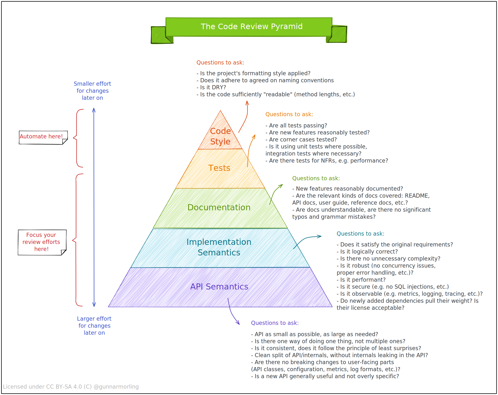

# The Code Review Pyramid

Posted at Mar 10, 2022

When it comes to code reviews, it’s a common phenomenon that there is much focus and long-winded discussions around mundane aspects like code formatting and style, whereas important aspects (does the code change do what it is supposed to do, is it performant, is it backwards-compatible for existing clients, and many others) tend to get less attention.

To raise awareness for the issue and providing some guidance on aspects to focus on, I shared a [small visual](https://twitter.com/gunnarmorling/status/1501645187407388679) on Twitter the other day, which I called the "Code Review Pyramid". Its intention is to help putting focus on those parts which matter the most during a code review (in my opinion, anyways), and also which parts could and should be automated.

As some folks asked for a permanent, referenceable location of that resource and others wanted to have a high-res printing version, I’m putting it here again:

